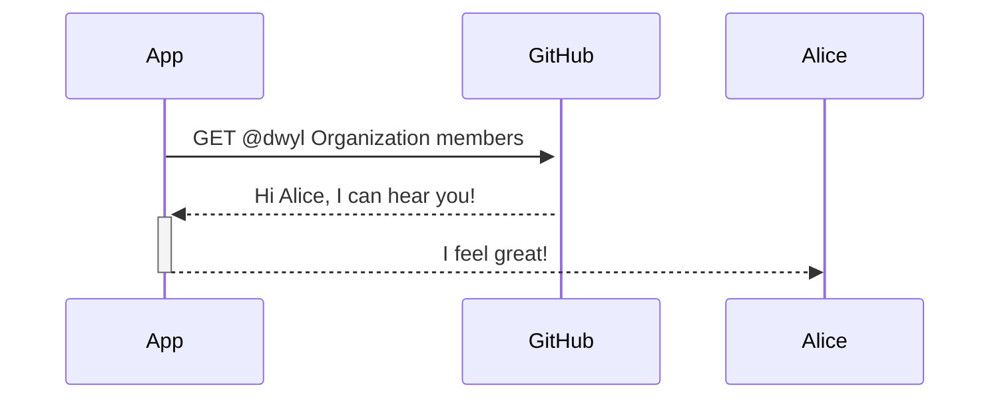

<div align="center">

# *Who*? 🦄


The **quick _answer_** 
to the question: 
**_Who_ is in the `@dwyl` community?**

</div>

# **`TODO`**: re-generate the "wall of faces" using latest data


# *Why*? 

We needed an **easy/fast/reliable _system_** 
to **_visualise_ who** is joining
the **`@dwyl` community** <br />
so that we can 
**track growth** over time. 📈

The [**start-here** > ***who***](https://github.com/dwyl/start-here/tree/8bbd28d2ab0c3b5a2a266a1e41fd160fc6ee3038#who) 
section is *woefully* out of date.  
(_this was 
[noted](https://github.com/dwyl/start-here/issues/9) 
a while back... 
but sadly was not made 
a priority at the time..._)  
This mini-app/project is designed 
to scratch our own itch
and save us
[time](https://github.com/dwyl/start-here/issues/255).

# *What*?

There are **_two_ ways** 
of discovering 
the list of people 
contributing to the 
**dwyl mission**:
## 1. *dwyl* Org's *People Page* on GitHub

Visit: https://github.com/orgs/dwyl/people and grab the list.  
*simple. effective. incomplete*. 
(*read on to understand why this list only scratches the surface!*)

## 2. List all Contributors to dwyl repos on GitHub

Read the Commit History for all the dwyl repos on GitHub
and extract the names of people ... 

As you can imagine, 
this second option 
is _painful_ to do _manually_ ... ⏳

So we _had_ to create an mini-App to do it for us! 💡

# *How*?

We built this mini-App 
using the 
[**`PETAL`** Stack](https://github.com/dwyl/technology-stack/#the-petal-stack)
because we feel <br />
it's the _fastest_ 
and most _effective_ way
to ship a web app.

## Build Log 👷‍♀️

If you want to **understand _every_ step**
of the process of **_building_** the **mini-app**,
read: 
[**`BUILDIT.md`**](https://github.com/dwyl/who/blob/main/BUILDIT.md)


## Run the MVP App on your `localhost` ⬇️

> **Note**: You will need to have 
**`Elixir`** and **`Postgres` installed**, <br />
see: 
[learn-elixir#installation](https://github.com/dwyl/learn-elixir#installation)
and 
[learn-postgresql#installation](https://github.com/dwyl/learn-postgresql#installation)
> respectively.
> **Tip**: check the prerequisites in:
> [**/phoenix-chat-example**](https://github.com/dwyl/phoenix-chat-example#0-pre-requisites-before-you-start)

On your `localhost`, 
run the following commands 
in your terminal:

```sh
git clone git@github.com:dwyl/app-mvp.git && cd app-mvp
mix setup
```
That will download the **`code`**, 
install dependencies
and create the necessary database + tables.

### Create `.env` file

Create an `.env` file by copying the sample:

```sh
cp .env_sample .env
```
Paste the value of your 

loads the 
[environment variables](https://github.com/dwyl/learn-environment-variables)
required to run the App.

### Get your `GitHub` Personal Access Token

To access the **`GitHub` API**,
you will need to generate a 
**Personal Access Token**:
[github.com/settings/tokens](https://github.com/settings/tokens)

Click on the **`Generate new token`** button.
Name it something memorable
once you've created the token,
copy it to your clipboard for the next step.

### Add your `GitHub` token to the `.env` file

Add your token after the `=` sign:

```sh
export GH_PERSONAL_ACCESS_TOKEN=
```

Once you've saved your `.env` file,
run:

```sh
source .env
```

Once you have sourced your `.env` file,
you can run the app with:

```sh
mix s
```

Open the App in your web browser
[**`localhost:4000`**](http://localhost:4000/)
and start your tour! 


<br />

## Contributing 👩‍💻

All contributions 
from typo fixes
to feature requests
are always welcome! 🙌

Please start by: <br />
a. **Star** the repo on GitHub 
  so you have a "bookmark" you can return to. ⭐ <br />
b. **Fork** the repo 
  so you have a copy you can "hack" on. 🍴 <br />
c. **Clone** the repo to your `localhost` 
  and run it! 👩‍💻 <br />


For more detail on contributing,
please see:
[dwyl/**contributing**](https://github.com/dwyl/contributing)

### More Features? 🔔

If you have feature ideas, that's great! 🎉 <br />
Please _share_: 
[**who/issues**](https://github.com/dwyl/who/issues) 🙏


<!--

sequenceDiagram
    Alice->>+John: Hello John, how are you?
    Alice->>+John: John, can you hear me?
    John-->>-Alice: Hi Alice, I can hear you!
    John-->>-Alice: I feel great!

-->

